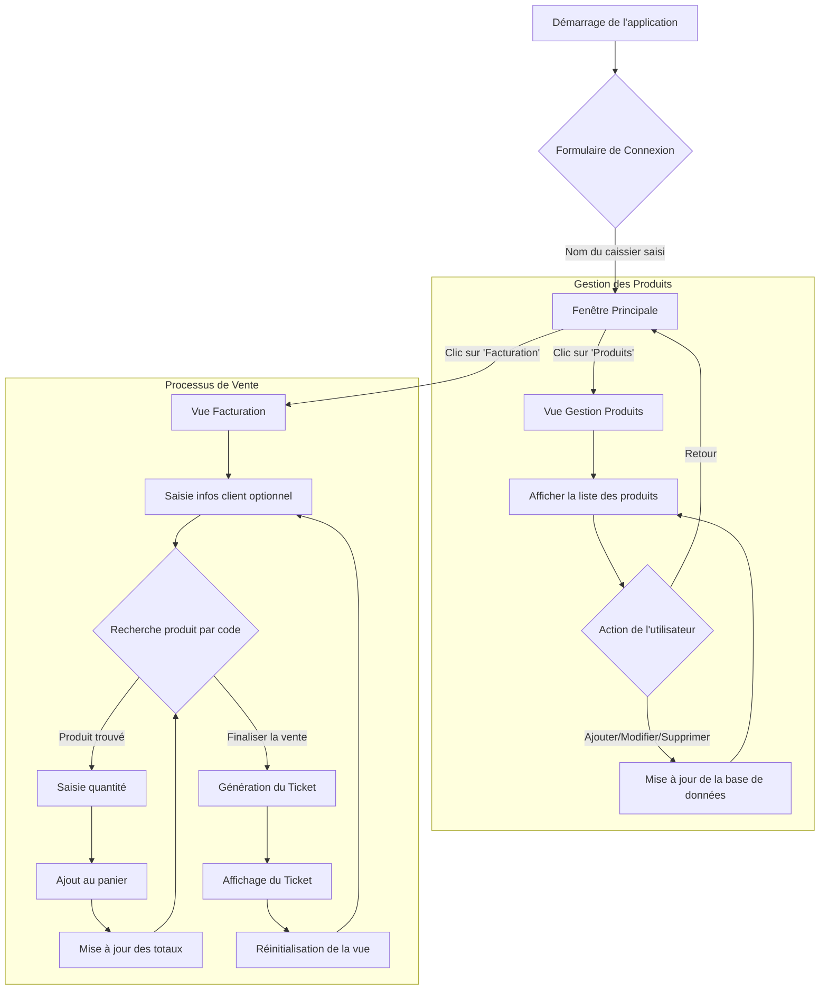

# Rapport de Projet : Système de Facturation

## 1. Matériel et Environnement

### 1.1. Présentation de l'IDE et du Code Source

*   **IDE Principal :** Jetbrains Rider
*   **Langage :** C# 12
*   **Framework :** .NET 9.0 avec Windows Forms
*   **Lien du Dépôt GitHub :** [https://github.com/wonder7b/groupe-4-c-sharp](https://github.com/wonder7b/groupe-4-c-sharp)

### 1.2. Système d’Exploitation et Performance
*   **Système d'Exploitation :** Windows 11
*   **Performance de la Machine :** Intel Core i5-8250U @ 1.60GHz
*   **Architecture de la machine :** X86-64
*   **Stockage de la machine :** 256Go SSD NVMe M.2
*   **Mémoire Vive (RAM) :** 16Go DDR4

## 2. Définition du Problème

### 2.1. Présentation du Cas Choisi
Le projet consiste à développer une application de bureau pour la facturation d'un magasin. L'objectif est de remplacer un processus manuel potentiellement lent et source d'erreurs par un outil informatique simple, rapide et fiable.

L'application doit permettre de :
*   Gérer un catalogue de produits (ajout, modification, suppression).
*   Créer une transaction de vente pour un client.
*   Constituer un panier d'achats en ajoutant des produits.
*   Calculer automatiquement les totaux, y compris la TVA.
*   Générer un ticket de caisse récapitulatif.

### 2.2. Analyse du Problème
Le système de caisse traditionnel repose sur la mémorisation des prix ou la recherche manuelle, ce qui est inefficace, surtout avec un grand nombre de produits. La gestion des clients est souvent inexistante, et le calcul des taxes est sujet à erreur.

La solution doit donc informatiser ces tâches en se concentrant sur la rapidité d'exécution (recherche par code), la fiabilité des calculs et la traçabilité (tickets de caisse).

### 2.3. Résolution Algorithmique et Ordinogramme

L'algorithme général de l'application suit le flux d'une transaction de vente typique.

**Algorithme :**
1.  **Démarrage & Connexion :**
    *   Charger la configuration du magasin (nom, adresse).
    *   Demander le nom du caissier.
2.  **Attente d'une action :**
    *   L'utilisateur peut naviguer entre la vue "Facturation" et la vue "Produits".
3.  **Flux de Facturation :**
    *   Saisir les informations du client (optionnel).
    *   Saisir le code d'un produit et rechercher.
    *   Si le produit est trouvé, saisir la quantité et l'ajouter au panier.
    *   Le panier se met à jour, les totaux (sous-total, TVA, total) sont recalculés.
    *   Répéter l'ajout de produits autant que nécessaire.
    *   Cliquer sur "Finaliser" pour générer le ticket.
    *   Le système génère un ticket complet, l'affiche, puis réinitialise l'interface pour la prochaine transaction.
4.  **Flux de Gestion des Produits :**
    *   Afficher la liste des produits depuis la base de données.
    *   Permettre l'ajout, la modification (en sélectionnant un produit) ou la suppression d'un produit.
    *   Toute modification est immédiatement sauvegardée en base de données.

**Ordinogramme :**


## 3. Démarche de l'Implémentation

### 3.1. Présentation de l'Interface
L'application est structurée autour d'une fenêtre principale (`Form1`) qui contient une barre de navigation simple et un panneau principal.
*   **Fenêtre Principale :** Affiche le nom du magasin et le caissier connecté. Elle contient deux boutons de navigation : "Facturation" et "Produits".
*   **Vue Facturation (`BillingView`) :** L'écran principal pour les ventes. Il est divisé en deux sections : les informations du client et la recherche de produits. Un grand tableau (`DataGridView`) affiche le panier en temps réel. En bas, les totaux sont clairement visibles.
*   **Vue Produits (`ProductsView`) :** Permet la gestion du catalogue. Un formulaire permet de saisir les détails d'un produit (code, nom, prix, TVA). Un tableau affiche tous les produits existants.

### 3.2. Présentation des Fonctionnalités
*   **Configuration Externe :** Les informations du magasin sont stockées dans `appsettings.json`, permettant une modification facile sans recompiler.
*   **Base de Données SQLite :** Utilisation d'Entity Framework Core avec SQLite pour une persistance des données simple et efficace.
*   **Recherche par Code :** La recherche de produits se fait par un code unique, ce qui est beaucoup plus rapide qu'une liste déroulante pour un grand catalogue.
*   **Calcul Automatisé :** La TVA et les totaux sont calculés en temps réel à chaque modification du panier.
*   **Génération de Ticket :** Le ticket de caisse est complet, incluant les détails du magasin, du client, du caissier, et un récapitulatif clair de la vente.
*   **Devise Personnalisée :** L'application est configurée pour afficher les montants en Franc Congolais (FC).

### 3.3. Code des Fonctions Principales

#### `SessionManager.cs` - Initialisation de la configuration
```csharp
// Services/SessionManager.cs
public static void Initialize()
{
    var configuration = new ConfigurationBuilder()
        .SetBasePath(System.IO.Directory.GetCurrentDirectory())
        .AddJsonFile("appsettings.json", optional: false, reloadOnChange: true)
        .Build();

    StoreInfo = new StoreInfo();
    configuration.GetSection("StoreInfo").Bind(StoreInfo);
}
```

#### `ProductsView.cs` - Sauvegarde d'un produit
```csharp
// Views/ProductsView.cs
private void SaveButton_Click(object sender, EventArgs e)
{
    // ... validation des entrées ...

    if (_selectedProduct == null) // Ajout
    {
        var newProduct = new Product { /* ... assignation ... */ };
        _dbContext.Products.Add(newProduct);
    }
    else // Modification
    {
        _selectedProduct.Code = code;
        // ... autres assignations ...
        _dbContext.Products.Update(_selectedProduct);
    }

    try
    {
        _dbContext.SaveChanges();
    }
    catch (DbUpdateException) // Gestion de l'unicité du code
    {
        MessageBox.Show($"Le code produit '{code}' existe déjà.", "Erreur de duplication");
        return;
    }
    
    LoadProducts();
    ClearForm();
}
```

#### `BillingView.cs` - Génération du ticket
```csharp
// Views/BillingView.cs
private string GenerateReceipt()
{
    var sb = new StringBuilder();
    var store = SessionManager.StoreInfo;
    var customerName = customerNameTextBox.Text.Trim();
    var customerPhone = customerPhoneTextBox.Text.Trim();

    sb.AppendLine($"----------- {store.Name} -----------");
    sb.AppendLine(store.Address);
    sb.AppendLine($"Date : {DateTime.Now:dd/MM/yyyy HH:mm:ss}");
    sb.AppendLine($"Caissier : {SessionManager.CashierName}");
    if (!string.IsNullOrEmpty(customerName))
        sb.AppendLine($"Client : {customerName} ({customerPhone})");
    sb.AppendLine("----------------------------------------");

    foreach (var item in _cart)
    {
        var formattedPrice = item.TotalPrice.ToString("C", CultureHelper.CongoleseFranc);
        sb.AppendLine($"{item.Product.Name,-20} (x{item.Quantity}) {formattedPrice,15}");
    }

    sb.AppendLine("----------------------------------------");
    sb.AppendLine($"Sous-total : {subTotalValueLabel.Text,25}");
    sb.AppendLine($"TVA : {taxValueLabel.Text,32}");
    sb.AppendLine($"TOTAL : {totalValueLabel.Text,28}");
    sb.AppendLine("----------------------------------------");
    sb.AppendLine($"         {store.ReceiptFooter}");

    return sb.ToString();
}
```
